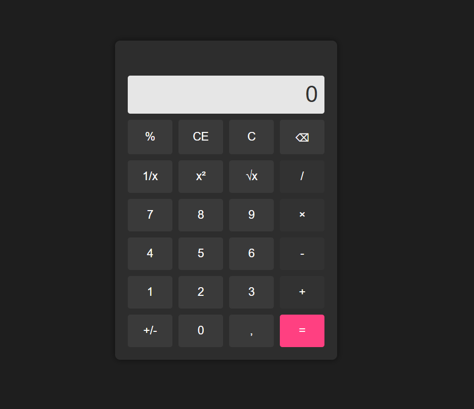
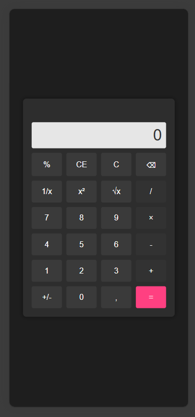

# Calculator

# Objetivo do projeto

Criar uma calculadora que realize operações matemáticas

## Resultado Final

- Algumas funcionalidades:

- Desktop

- Mobile

## Licença

Este projeto está sob a licença do MIT. Consulte a [LICENSE](LICENSE) para obter mais informações.

## Como contribuir

1. Siga as diretivas do [CONTRIBUTING.md](docs/CONTRIBUTING.md) foi incluso instruções da execução do script **user_data_ec2** nas diretivas de contribuição.

## Autores

- [Neto Rodrigues](https://github.com/Neto6391)
